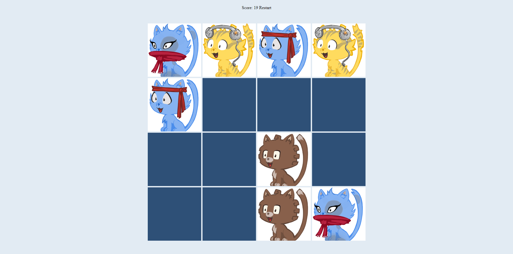

# Memory Game

> Memory game made using Vanilla JS.
> Live demo [_here_](https://loremmemorygame.netlify.app/).

## Table of Contents

- [General Info](#general-information)
- [Technologies Used](#technologies-used)
- [Features](#features)
- [Screenshots](#screenshots)
- [Project Status](#project-status)
- [Room for Improvement](#room-for-improvement)
- [Acknowledgements](#acknowledgements)

## General Information

- Simple memory game with score counter
- Images fetch from external API
- Project made for learning

## Technologies Used

- Java Script
- Html/css

## Features

List the ready features here:

- game logic
- score counter
- fetching images

## Screenshots

## Project Status

Project is: _in progress_

## Room for Improvement

Room for improvement:

- User interface
- leaderboard

## Acknowledgements

- This project was inspired by [_this tutorial_](https://youtu.be/-tlb4tv4mC4) by [_developedbyed_](https://developedbyed.com/)
